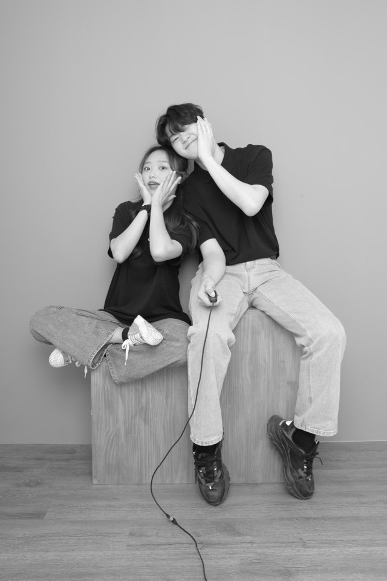
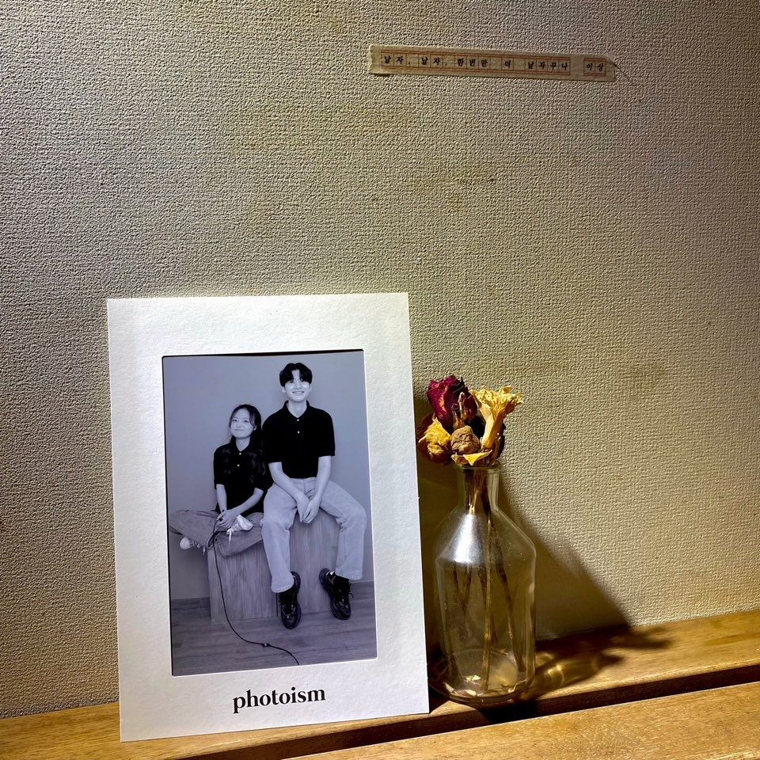

### 오랜만에 나들이

오늘은 새볔 6시까지 개발 공부를 하다가 센이랑 한 약속을 갔다! 그 약속이 무엇이냐 하면은!!!! 바로 포토이즘이라는 사진관에 체험단으로 가게된 것이다. 내가 개발에 매진하느라 데이트도 제대로 못해보고 해서 세인이가 특별히 예약해줬다. (물론 당일도 새볔 6시까지 개발하다가 늦어서 혼났다.)

오늘 한 것이라고는 사진 찍고 건대에서 텐동을 먹은 것이다. 샤로수길에 정말 맛있는 텐동집이 있었는데 거기에 비해는 그렇게 맛있다는 느낌은 받지 않았다. 하지만 세인이랑 함께면 뭐든게 맛있어지는 마술.

나는 세인이 먹을때 기분이 최고조로 좋다.

세인이는 항상 다이어트라는 마녀에게 붙잡혀 괴롭힘들 당하는 불쌍한 친구거든...

### 알찬 하루

오늘 한 것이라고는 포토이즘에 사진찍으러 갔다가 텐동 먹으러 가고 카페를 간 것 뿐이였지만 생각보다 알찼다. 요즘 제대로 된 데이트를 너무 안했나보다. 세인아 조금만 기다려!!! 내가 취업하면 어디든, 뭐든 다 사주고 다 데려갈게!

내 블로그의 첫 일상글은 이렇게 세인이와의 추억을 남겨두고 싶었다. 지금 보니까 이 사진들 내 블로그랑 꽤나 잘어울리는 것 같다. 세인이가 이 글을 읽을지 안읽을지는 모르지만 나 챙겨주고 살피는 단 하나뿐인 친구라 항상 고맙고 아련하다. (물론 밖으로 티는 잘 안냄)

이렇게 첫 블로그 일 상 포스트를 마쳤다!!! (뿌.듯)

그럼 난 다시 코딩하러...
