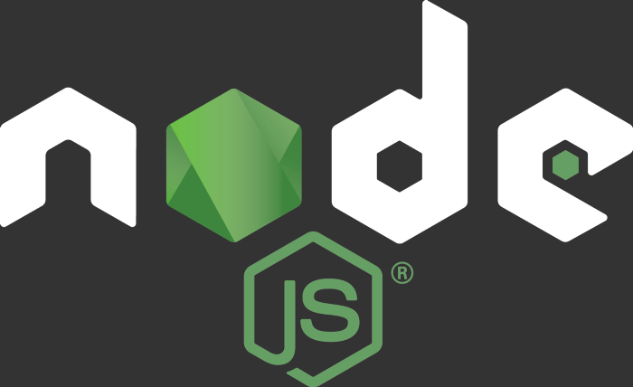

무언가 언어를 공부하려면 그에 대한 역사를 보는것이 흥미도 돋굴 수 있고 이해하는데 있어서 도움이 된다. 그러므로 자바스크립트와 익스프레스의 역사에 대하여 간단히 짚고 넘어가겠다.

### Express란?



자바스크립트는 오늘날 가장 빠르게 발전하고 인기 있는 언어중 하나이다. 본래 간단한 언어였지만 점점 발전하면서 백엔드의 영역까지 들어오게 되었다.

2009년에 등장한 Node.js는 현시대 가장 많이 사용하고 있는 구글 크롬의 강력한 JS 엔진인 V8을 채용했고 서버에서 이를 실행할 수 있도록 했다. 웹개발자들의 시대가 열린 것이다. JS는 웹용 언어였고 현재도 웹용언어로 많이 쓰이고 있다.

이러한 개발자들에게 익숙한 언어인 JS를 이제 서버 사이드를 개발할 때도 사용할 수 있게 되었다. 이러한 장점 때문에 Node.js의 인기는 날로 높아졌다.

### Express의 장,단점

이렇게 좋은 express, 단점도 있다.

먼저 기본이 되는 Node.js , 필자는 아직 못느끼겠지만 Node.js는 애플리케이션을 만드는 데 필요한 일련의 저수준 기능을 제공한다. 그러나 브라우저 기반의 JS처럼, 저수준의 기능은 장황하고 사용하기 어려울 수 있다.

Express는 개발자 마음데로 미들웨어를 붙힌다거나 하는 것이 살짝 힘들다. 내장된 에러핸들링이 없기 때문이다. 이러한 문제들 때문에 수작업이 많아지는 경향이 있고 문제에 대한 접근법이 여러가지다.

장점은 이것 빼고 전부다. 쉽고,간편하고 코드 재사용에 용이하다. 또한 커뮤니티가 방대하다. 짧지만 강력한 장점들이다.

### Express로 간단한 서버 열기

**Express를 통해서 간단한 서버를 구축해볼 것이다.**

먼저 express를 설치하자.

```javascript
npm install express
```

그 후, 파일을 열어 정의한다.

```javascript
const express = require("express");
//express모듈을 가져온다.
const app = express();
//express 객체를 생성해준다.
const port = 5000;
```

서버는 항상 포트를 기준으로 무언가 정보를 주고받는다. 나의 경우 보통 5000으로 한다.(포트는 몇으로 하든 상관없다.)

이렇게 정의가 다 끝났으면 서버를 열 준비가 끝났다. 사용만 하면 된다.

```javascript
const express = require("express");
const app = express();
const port = 5000;

app.get("/", (req, res) => res.send("Hi Express"));

app.listen(port, () => console.log("hi express!!"));
```

설명을 해보자면

app.get 부분에서 get은 라우트 메소드다. express는 HTTP의 라우팅 메소드를 지원하기 때문에 get,post,delete등 많은 메소드를 지원한다.

req,와 res는 각각 요청과 응답이다. req에는 보통 클라이언트에서 요청한 작업 데이터가 들어온다. res는 요청을 끝마친후 응답할때 사용된다.

라우트 경로는 첫번째 인자에 넣는데 그냥 첫페이지 서버 실행 화면이기 때문에 기본으로 "/"를 쓴다. "/라우트경로" 이렇게 사용하면 된다.

listen은 말 그대로 청취한다는 뜻이다. 첫번째 인자에 port를 넣어주면 그 포트로서의 서버가 시작된다. 이제 서버를 작동시킬 때마다 콘솔에 hi express!!가 떠있을 것이다.

서버 설정을 다 마쳤으면 이제 구동해보자.

```javascript
node index.js
```

"localhost:5000/" 이 주소로 들어가면 열린 서버를 확인할 수 있을 것이다. 참 쉽지?

그럼 오늘도
**_just do it!_**
