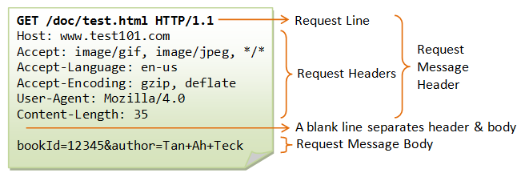
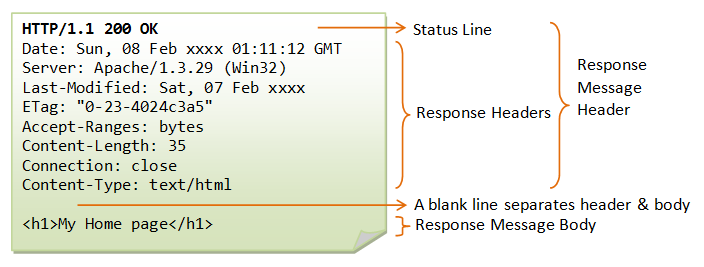

**웹을 구성하는 요소는 무엇이 있을까?**

### WEB의 구성요소

총 4가지 구성요소가 있다.

**첫 번째는, 웹페이지를 만드는 컴퓨터 언어인 HTML**
**두 번째는, 원하는 웹페이지에 방문할 수 있도록 도와주는 url**
**세 번째는, 웹페이지를 주고 받는 소프트웨어인 웹브라우저와 웹서버.**
**마지막으로, 웹브라우저와 웹서버가 통신을 할 때 사용하는 통신규칙인 HTTP**

위 네 가지 요소가 필수적으로 들아가야 비로소 우리가 보는 웹페이지가 세상에 나오게된다. 이중에서 이번 포스팅에서는 HTTP를 중점으로 다뤄 볼 생각이다.

### HTTP란?

저번 포스팅에도 말했듯이, http란 웹브라우저와 웹서버가 통신하기위해 정해둔 일종의 통신 규약이다.

영어로 말하자면, **H**yper **T**ext **T**ransfer **P**rotocal 이다.
이걸 해석하면 **H**yper **T**ext는 웹페이지 , **T**ransfer는 전송, **P**rotocal은 규약이다.

### Request message

위 사진이 request message이다. 한 사진에 모든게 잘 설명되어 있어서 가져왔다.

#### 메소드

header에 보면 get이나 post 같은 영어가 적혀있는 것을 볼 수 있다. 이런 것들은 모두 http에서 지원하는 메소드라고 볼 수 있다.

_이것은 웹브라우저와 웹서버가 어떤 방식으로 통신할 것인가 정의한 것이다. (사진에선 GET)_

_가운데 값은 요청할 정보이다.(doc/test.html)_

_그 뒤에 http1.1 이런 문구는 웹브라우저에서 현재 사용하고 있는 http의 버전을 뜻한다.(HTTP/1.1)_

#### Host

여기부터는 헤더부분이다.

헤더에는 여러가지 정보들이 있지만 필수적인 것은 호스트다. 호스트는 인터넷에 연결되어 있는 컴퓨터를 식별하는 이름이다.

예를 들어, 하나의 웹서버가 여러개의 도메인을 서비스할 수 있다. 각각의 주소별로 다른 웹사이트일 것이다.

이때 웹서버는 host에 적혀있는 주소를 보고 각각 다른 정보를 보내줄 수 있는 것이다.(가상호스트)

뒤에 8000,3000,8080 이런 숫자는 포트라고 한다.

#### User-agent

user-agent는 웹브라우저의 다른 표현이다. 운영체제마다 다 다르게 나오게된다.

이것을 활용하면 웹서버를 운영할때 웹사이트에 어떤 브라우저나, 운영체제를 사용하는 사람들이 많이 사용하고 있는가, 통계를 낼 수도 있고 로봇의 해킹을 차단할 수 있다.

#### Accept-Encoding

압축 시스템이다. 웹브라우저와 웹서버가 통신 할 때 그 양이 많으면 압축 시켜주는 역할을 한다. 덕분에 네트워크의 자원을 아낄 수 있다.

그 밖에 많은 정보가 있으니 나머지는 궁금할때마다 구글링을 해보자.

#### If-Modified-Since

이것은 파일 갱신 시스템이다. 언제 마지막으로 다운받았는지 알려준다.

웹서버는 이것과 비교해서 자신의 것이 최신이면 그것을 보내주고 아니면 전송을 하지 않는다.

### Response message

위 사진을 보면 요청과 비슷하게 되어있다.

#### status Line

뒤에 200 ok가 보이는가? 이것은 응답신호이다. 정말 중요하다.

2xx : 긍정적인 메세지이다. 200 ok는 성공이라는 표현이다.
3xx : 리다이렉트 메세지이다. 웹브라우저가 다른곳으로 바로 리다이렉트한다.
4xx : 클라이언트쪽 에러 메세지이다.

404 not found는 페이지를 찾을 수 없어서 나오는 메세지이다.

403에러는 접속하면 안되는 곳에 접속할 때 많이 나오는 문구이다.

5xx : 서버쪽 에러 메세지이다.

#### Content-Type

굉장히 중요한 헤더다. 웹서버가 응답할 파일의 형식을 말해준다.

만약 text/html이라면 html로 해석한다.

#### Content-Length

응답하는 이 컨텐츠의 사이즈를 말해준다. 단위는 byte이다.

#### Content-Encoding

위 사진에는 없지만 아까와 똑같은말로 압축 형식이다. 이것이 무엇이냐에 따라 어떤 방식으로 압축을 풀어야하는지 알 수 있다.

### HTTPS

http에 보안체계를 덧붙힌것이다. S는 secure의 약자이다. 똑같은 말로 SSL이다.

http를 통해서 통신을 할 때 민감한 정보를 보낼때의 문제점을 해결하고자 세상에 나왔다. 이것으로 정보를 보내면 정보가 암호화 되어서 전달 된다.

### Cache

캐시는 이미 다운로드 받은 파일들을 저장시켜서 다시 다운받지 않도록 하는 기법이다.

캐시는 문제가 하나 있다. 갱신이 되도 알아차리지 못하는 현상이 있다...

캐시 컨트롤이나 pragma 같은 기법들은 이런 문제를 해결하려고 고안되었다.

### Cookie

장바구니나 로그인 정보 같은 값을 웹브라우저에서 유지할 수 있도록 도아주는 역할을 한다. 이름이 아주 귀엽다.

쿠키값을 웹브라우저에 설정하면 접속할때마다 서버에 전송하고 그 사용자를 식별하거나 상태를 유지할 수 있다.

그럼 오늘도
**_just do it!_**
